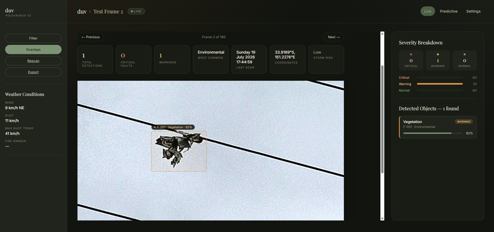

# DUV — Power Line Fault Inspector

An AI-powered drone inspection simulator for power line assets. A fine-tuned YOLOv8 model detects faults on power line infrastructure - broken conductors, damaged insulators, vegetation encroachment - and a Flask dashboard presents the results the way a real inspection tool would: live detection overlays, severity triage, and real-world weather risk pulled from Australia's Bureau of Meteorology.

Built as a portfolio project sitting at the intersection of computer vision, energy infrastructure, and dashboard design.

## What it does

- Runs a custom-trained YOLOv8 model over a sequence of drone-perspective power line photos, simulating a drone flying a corridor inspection
- Draws real-time bounding boxes and confidence scores over each detected fault
- Classifies each detection by severity (critical / warning / normal) and surfaces the day's most pressing issues
- Cross-references detection locations against **live** Bureau of Meteorology data - active storm warnings, wind/gust speed, and bushfire danger rating and automatically escalates fault severity when a detection falls inside an active weather warning zone
- Exports an annotated image of any frame for record-keeping
- Ships with three switchable colour themes (Editorial, Telemetry, Daylight), persisted per user via cookie

## Screenshots



## Tech stack

- **Model:** YOLOv8n (Ultralytics), fine-tuned via transfer learning
- **Backend:** Flask, Jinja2 templating
- **Frontend:** Vanilla HTML/CSS/JS — no framework, no build step
- **Live weather data:** Bureau of Meteorology (BOM) public-facing API
- **Dataset:** [Roboflow "84" power transmission line dataset](https://universe.roboflow.com/power-transmission-line/84-vlr8w) (CC BY 4.0)

## Getting started

```bash
git clone https://github.com/mindyy12/duv-powerline-detection.git
cd duv-powerline-detection

python -m venv venv
source venv/bin/activate        # Windows: venv\Scripts\activate

pip install -r requirements.txt

python app.py
```

Then open `http://localhost:5000`.

The trained model weights (`runs/detect/train-2/weights/best.pt`) and the Roboflow dataset (`train/`, `valid/`, `test/`) are not included in this repo — see [Model training](#model-training) below to reproduce them, or drop in your own weights at that path.

## Project structure

```
app.py                 Flask app — routes, BOM integration, severity logic
train.py                Fine-tuning script
detect.py                Standalone inference script (Phase 1 / ad-hoc testing)
evaluate.py               Runs the trained model against the held-out test set
data.yaml                 YOLO dataset config
templates/               Jinja2 templates (base shell + Live/Predictive/Settings pages)
static/style.css            All dashboard styling, theme tokens
```

## Model training

Fine-tuned `yolov8n.pt` on 6 classes — Broken Cable, Broken Insulator, Cable, Insulators, Tower, Vegetation — for 60 epochs on CPU.

| Metric | Validation | Test set |
|---|---|---|
| mAP50 | 0.493 | 0.540 |
| mAP50-95 | 0.302 | 0.340 |

Per-class performance varies significantly — Vegetation (mAP50 0.876) and Broken Cable (0.796) perform strongly, while Tower (0.295) has a notably high false-negative rate, largely missing detections rather than misclassifying them. See [Known limitations](#known-limitations).

## Known limitations

- **Only detects its 6 trained classes.** It has no concept of anything outside that list (e.g. protection equipment like relays or circuit breakers) and won't generalize to it.
- **Doesn't generalize outside its training distribution.** It was trained almost entirely on aerial/drone-angle photos; ground-level shots of different infrastructure (tested informally) produce unreliable, low-confidence, occasionally nonsensical detections.
- **Some source dataset images are mosaic composites** — a handful of images in the Roboflow dataset are 4-panel stitched grids rather than single clean photos, which likely hurts training and evaluation quality for the frames affected.
- **Tower detection is weak** — the model correctly finds only ~27% of real towers in the test set (high false-negative rate), rather than confusing them with other classes.
- **The weather/coordinate data is illustrative, not from a real drone.** Per-frame GPS coordinates are synthetically generated (walking a small simulated flight path near Sydney, NSW) so the BOM integration has real coordinates to query — the weather data returned for those coordinates is genuinely live and real, but it isn't tied to an actual drone's real-world position.
- **The BOM API used is undocumented/unofficial** — it's the same API BOM's own consumer weather app uses, reverse-engineered by the community. It has no formal uptime or rate-limit guarantees, and its response includes a copyright notice restricting reuse — used here for personal/educational demonstration only.

## Roadmap

- **Predictive tab** — currently a placeholder. Planned: a live climate-risk heatmap layer combining real BOM bushfire danger ratings and wind data across a grid of points, rendered on an interactive map.
- **Natural language query layer** — ask plain-English questions ("what's the most critical fault detected today?") grounded in the actual live detection data, backed by an LLM.

## Acknowledgements

- Dataset: [power-transmission-line / 84](https://universe.roboflow.com/power-transmission-line/84-vlr8w) on Roboflow Universe, CC BY 4.0
- Weather data: Bureau of Meteorology (Australia)
- Base model: [Ultralytics YOLOv8](https://github.com/ultralytics/ultralytics)
